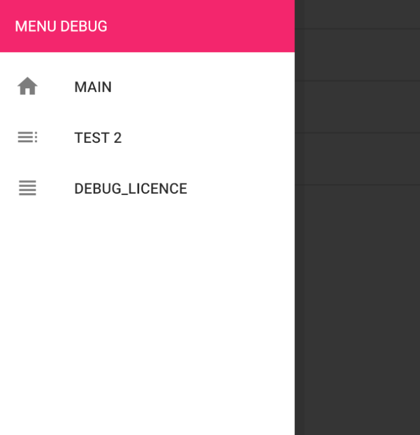
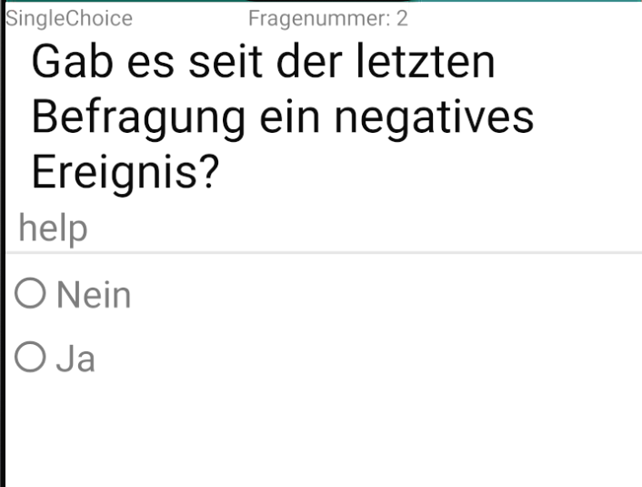
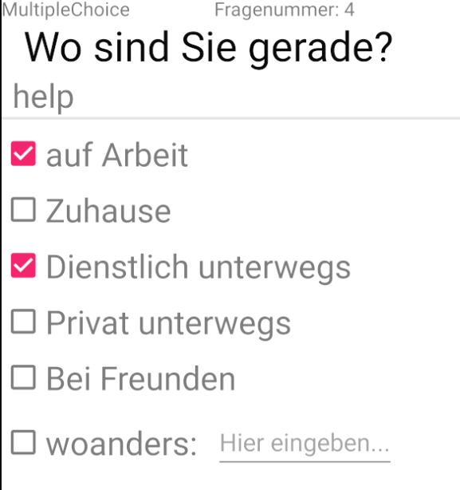
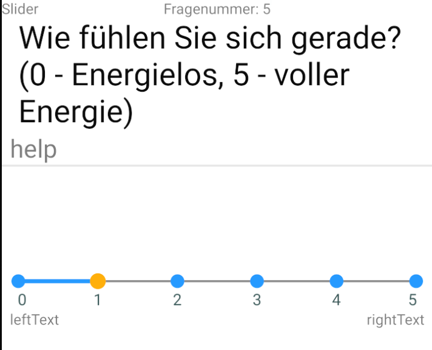
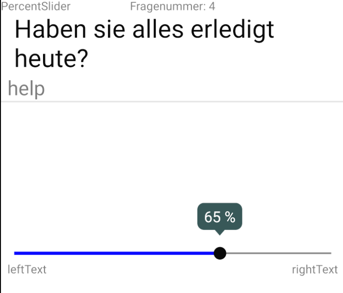

Bedienungsanleitung

Nach dem Öffnen der App befinden Sie sich im Hauptmenü.

Von hier aus haben Sie die Möglichkeit in die Sidebar(Seitenmenü) zu gelangen. Drücken Sie dazu einfach auf den Button oben links. 

In diesem Menü  können Sie: 

1.  Zurück zum Hauptmenü springen
2.  die Lizenzen ansehen

Desweiteren können Sie im Hauptmenü einen Fragebogen auswählen und ihn starten. Zu Beginn des Fragebogens erhalten Sie noch einmal Rückmeldung welcher Fragebogen geladen wurde.

Wie es von hier aus weiter geht hängt jetzt vom Aufbau des Fragebogens ab, die Bedienung ist schlicht und intuitiv gehalten um jedoch Missverständnisse zu vermeiden folgt jetzt eine Liste der Möglichen Fragetypen.

1. SingleChoice     
           
    Wählen Sie eine Antwortmöglichkeit aus.

2. MultipleChoice   
       
    Wählen Sie alle zutreffenden Antwortmöglichkeiten aus. Dabei kann es vorkommen das Sie auch eine eigene Antwortmöglichkeit eingeben können

3. Slider   
       
    Geben Sie Ihre Antwort an indem Sie den Slider an die gewünschte Position ziehen. Orientieren Sie sich dabei an den Beschriftungen rechts und links.

4. PercentSlider   
       
    Geben Sie Ihre Antwort prozentual an. Klicken Sie dazu auf den Sliders(Schieber) und schieben ihn an die gewünschte Position. Orientieren Sie sich dabei an den Beschriftungen rechts und links.

5. ButtonSlider     
       
    Klicken Sie auf ein Feld das am ehesten Ihrer Antwort entspricht. Orientieren Sie sich dabei an den Beschriftungen rechts und links.

6. TableView    
       
    Wählen Sie ein Feld der Tabelle aus. Sie können sich dabei an den Beschriftungen der Tabelle orientieren. 

Wenn Sie Ihre letzte Frage beantwortet haben erhalten Sie eine Rückmeldung und haben die Möglichkeit zur Startseite zurück zu kehren.
